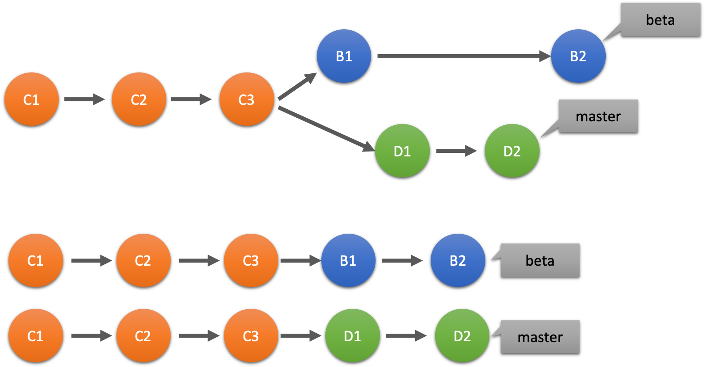
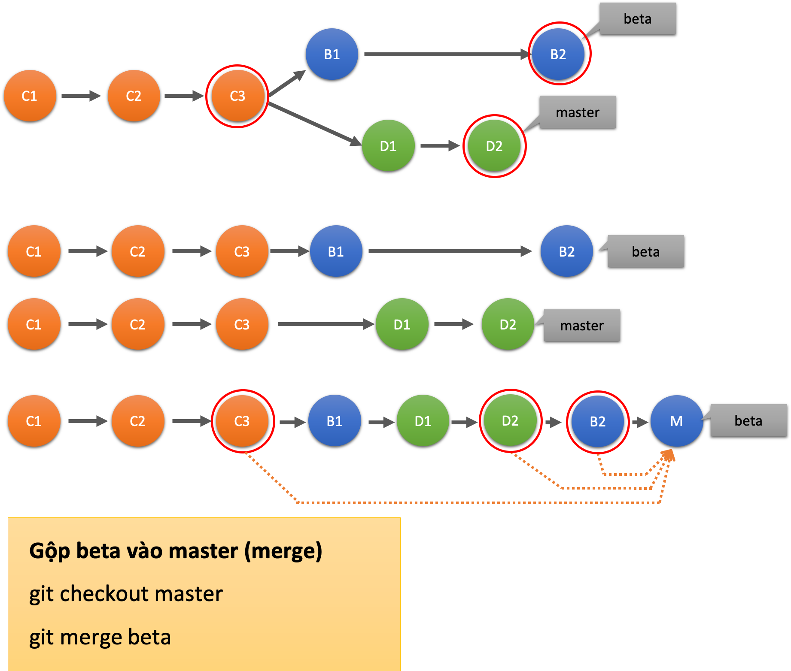

## Overview
### Git là gì?

- Git là một hệ thống quản lý phân tán (DVCS), giúp quản lý dự án đơn giản, dễ dàng hơn.  
- Các file có thể nằm trong 3 trạng sau của git: 
    * commited: Dữ liệu được lưu trữ an toàn trong Database 
    * modified: File có thay đổi nhưng chưa được lưu trong Database
    * staged: Đánh dấu các file sửa đổi **modified** để cho commit tiếp
- Git tổ  chức chia thành 3 khu vực:
    * Working tree
    * Staging
    * Git directory 

### Các trạng thái trong git 


* *Tracked*: là tập tin đã được đánh dấu theo dõi trong Git. Trong *Tracked* có các trạng thái phụ:
	+ Unmodified: Chưa chỉnh sửa 
	+ Modified: Đã chỉnh sửa nhưng chưa đưa vào *StagingArea*
	+ Staged: Đã đưa vào *StagingArea* và chuẩn bị commit 
* *Untracked*: các tập tin mới được tạo ra và chưa được đánh dấu theo dõi 

### Git Commit 

- `git commit` thực hiện lưu toàn bộ nội dung trong vùng Staging vào CSDL Git và *log* mô tả thay đổi so với commit trước 
	* `$ git commit -m "Add README"`
- Thêm -a sẽ thực hiện lệnh `git add` để đưa các file đang được giám sát có sự thay đổi vào staging rồi tự động chạy git commit
	* `$ git commit -a -m "Add README"`
- Amending: Sử dụng khi không muốn tạo nhiều commit bằng cách thêm tham số --amend
	```
		$ git commit -m "Add index.txt"
		$ git add ductn/index.txt
		$ git commit --amend 
	```

### Git reset

- Dùng lệnh `git reset` để  undo, hủy commit cuối hooawcj hủy đưa thay đổi vào vùng staging. 
- Khi đã thực hiện **commit** và chưa **push** thì có thể hủy commit đó theo 2 trường hợp: 
	* Thêm tham số  **--soft**, trường hợp này sẽ hủy commit cuối, con trỏ HEAD sẽ chuyển về commit cha, và những thay đổi của commit cuối được chuyển vào vùng **staging** để có thể commit lại hoặc sửa lại 
	`$ git reset --soft HEAD~1`
	* Thêm tham số **--hard** thì commit này sẽ không được đưa vào vùng **staging** mà sẽ bị hủy luôn
	`$ git reset --hard HEAD~1` 

### Git branch

- Tạo branch mới
	* `$ git branch ductn1`
- Thay đổi tên branch 
	* `$ git branch -m ductn1 ductn2`
- Chuyển branch 
	* `$ git checkout master`
- Merge branch 
	* `$ git merge ductn2`

### Git merge 

- Lệnh `git merge` dùng để  gộp các nhánh với nhau, sau khi gộp git sẽ tạo bản commit trên nhánh đấy và lịch sử commit không đổi.
- Giả sử  có 2 nhánh master và beta:

	

	* Để gộp các commit trong nhánh beta vào nhánh master thì chuyển làm việc trên master và thực hiện lệnh:
	`$ git merge beta`
	* Sau khi merger sẽ được kết quả

	  

### Git rebase 

- Lệnh `git rebase` cũng gộp commit từ nhánh này sang nhánh khác bằng cách xây lại các commit base kế thừa từ nhánh khác và viết lại lịch sử commit. 
- Để  viết lại lịch sử  của git sử dụng interactive rebase
	* `$ git rebase -i`
	* Chạy lệnh `git rebase -i` trên chính branch cần sửa nhưng lui về 1 ver bằng cách chỉ định `HEAD~1`
	`$ git rebase -i HEAD~1`
- Để  gộp các nhánh vào thực hiện lệnh
```bash
$ git checkout master
$ git rebase [branch]
```
- Git rebase khi remote có update mới
	* `$ git pull --rebase`

### Git Cherry-pick

- **Git Cherry-pick** là một cách để checkout một commit tại branch nhất định về branch hiện tại.
```bash
$ git checkout master
$ git cherry-pick other-commit
```
Lúc này nhánh **master** sẽ áp dụng những thay đổi trong **other-commit** về **master** 

### Git remote

- Quản lý các liên kết tới remote repo. Lệnh `git remote` cho phép tạo, xem và xóa kết nối giữa các Repo.
- Để liệt kê các liên kết sử dụng
	* `$ git remote` và hiện thị thông tin chi tiết hơn, có thêm đường dẫn đến remote Repo sử dụng `$ git remote -v`
- Tạo và xóa 1 liên kết
	* `$ git remote add remote-name url`
	* `$ git remote rm remote-name`
- Đổi tên remote
	* `$ git remote rename old-name new-name`
- Xóa các *remote branch* không được tham chiếu tới local
	* `$ git remote prune origin`

### Git Stash 

- Sử dụng khi muốn lưu lại những thay đổi *chưa commit*. Để lưu lại nội dung đang làm sử dụng lệnh: 
	* `$ git stash save ` or `$ git stash`
- Xem lại danh sách các stash đã lưu 
	* `$ git stash list`, xem lại cả nội dung `$ git stash list -p`
- Lấy lại thay đổi và xóa nội dung thay đổi lưu trong stash 
	+ ```
		$ git stash apply stash@{1}
	   	$ git stash drop stash@{1}
	  ```
	+ Hoặc sử dụng `$ git stash pop stash@{1}`
	+ Xóa toàn bộ `$ git stash clear`

### Tùy chọn force 

- Git `push --force` rất **nguy hiểm**, vì theo cơ chế  nó sẽ ghi đè lên remote repo bằng code ở local của mình, mà không cần quan tâm đến việc bên phía remote đang chứa thứ gì nên dễ làm mất code. Vì vậy, sử dụng `--force-with-lease` khi push sẽ giúp trong trường hợp cần force push code lên remote nhưng vẫn đảm bảo không mất code trước đó.

### [me](https://github.com/ductnn)
